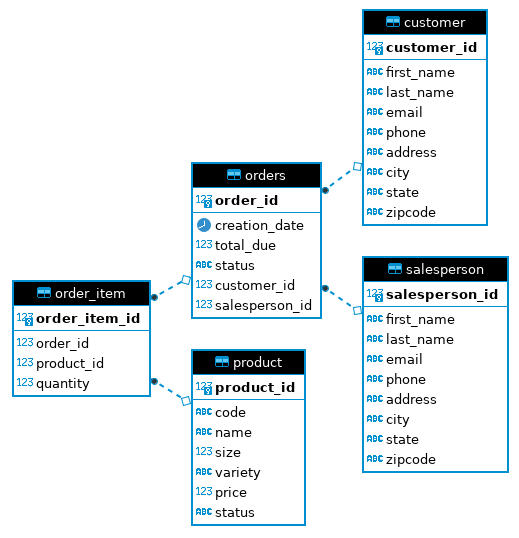

# Introduction
The Java Database Connectivity (JDBC) application is used to create a connection to a PostgreSQL database. The application allows for the client to perform predefined operations to the database, such as CRUD (create, read, update, delete). The project uses the following technologies:
* Java
* JDBC
* SQL
* Maven
* Docker
* PostgreSQL

# Implementaiton
## ER Diagram

## Design Patterns
### Data Access Object (DAO)
The Data Access Object (DAO) pattern is a design pattern that allows for isolation of the application or business layer from the persistence layer (a relational database). This is typically done using an abstract API. The purpose of this API is to hide from the application all the complexities involved in performing CRUD and other operations in the underlying program. It permits both layers to be developed separately without knowing about each other's processes.

### Repository
The Repository pattern consists of classes or components that encapsulate the operations used to access data sources. This focuses on being able to access one table per class and performing join operations in the code rather than database. Similar to DAO patterns, it hides data access functionality, such as CRUD, providing easier maintainability. This lets you focus on the data persistence logic rather than on data access plumbing. DAO and Repository differ from each other as DAO focuses on the abstraction of data persistence, while Repository is an abstraction of a collection of objects.

# Test
How you test your app against the database? (e.g. database setup, test data set up, query result)
The database was tested by creating tables and populating the database with sample data from SQL scripts. In order to test if these SQL statements were successful, queries were performed after any new data was added.`JDBCExecutor` was used to run and test functionality. CRUD operations and join operations were tested by creating, updating and deleting mock data and printing to the CLI to see if the expected matches the results.