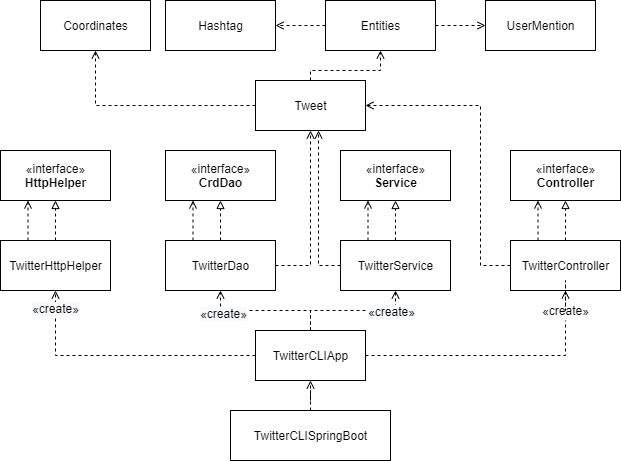
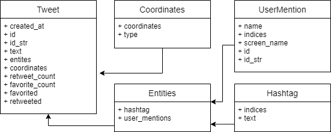

# Introduction
The Twitter CRUD App is an application that allows the user to post, read and delete Tweets on a Twitter Developer Account via the official Twitter REST APIs. This app is designed following the well-known MVC architecture, consisting of a model, controller layer, service layer and data access (DAO) layer. Then, it is tested using JUnit and Mockito tests. This app has been dockerized and is available to pull as an image on the DockerHub. The technologies used in this application are:
- Maven
- Java (JDBC)
- HTTP & JSON
- Junit & Mockito
- Spring
- Docker
- Twitter REST APIs

# Quick Start
## Environment Variables
The following environment variables must be exported from a Twitter Developer App:
- `consumerKey`: API Key
- `consumerSecret`: API Secret
- `accessToken`: Access Token
- `tokenSecret`: Access Secret

## Usage
### POST
Allows the user to post a tweet with a geotag.
- `TwitterApp post tweet_text longitude:latitude`
### SHOW
Allows the user to read a tweet using the id of a tweet.
- `TwitterApp show tweet_id [field1, field2, ..]`
### DELETE
Allows the user to delete one or more tweets.
- `TwitterApp delete [id1, id2, ..]`

## 1. Maven
Run program using Maven:
```bash
mvn clean package -Dmaven.test.skip=true
java -jar target/twitter-1.0-SNAPSHOT.jar post|show|delete [options]
```
## 2. Docker
Run program using Docker:
```bash
docker pull julngyn/twitter

docker run --rm \
-e consumerKey=YOUR_KEY \
-e consumerSecret=YOUR_KEY \
-e accessToken=YOUR_TOKEN \
-e tokenSecret=YOUR_TOKEN \
julngyn/twitter post|show|delete [options]
```

# Design
## UML diagram


### App
- `TwitterCLIApp`: This component takes the user input from the Linux CLI and calls the post/show/delete methods in the Controller with the CLI arguments. It also retrieves the system environment variables, allowing the app to use the given keys and tokens.
### Controller Layer
- `TwitterController`: The Controller retrieves the CLI arguments and verifies that the arguments, checking that the user has given the correct number of arguments and the correct format. It then calls the post/show/delete methods in the Service layer.
### Service Layer
- `TwitterService`: The Service layer of the app performs the business logic.
    - Verifies that the `tweet_text` is less than 280 characters.
    - Verifies that the `tweet_id` is in the correct format.
    - Verifies that `longitude` is between -180 and 80 and that `latitude` is between -90 and 90.
### DAO Layer
- `TwitterDao`: The Data Access (DAO) layer is responsible for handling HTTP requests and responses, retrieving and sending information to and from Twitter. It uses `TwitterHttpHelper` and URI statements to assist in the execution of POST and GET requests.
## Models
### Tweet
The Tweet model used in the Twitter app is a simplified version of the complete Tweet model. It excludes any attributes that are not used in this application. A `Tweet` object is used, which contains `Entities`, `Coordinates`, `UserMention` and `Hashtag` objects.


## Spring
All depenencies in the Twitter app are handled using the Spring framework. `@Component`, `@Controller`, `@Service` and `@Repository` were used to indicate a bean implemented in the `TwitterCLISpringBoot` class. These beans were scanned using the `TwitterCLIComponentScan` class, as a replication of the `@ComponentScan` Spring function.

# Test
The app was tested using both Integration and Unit testing in JUnit 4. Integration testing requires dependencies to be correct and complete before testing, ensuring that the previously written programs are correct before testing the current running program. Meanwhile, unit testing uses Mockito to create mock objects as a replacement for dependencies. This allowed for the testing of individual components during the development of the app.

## Deployment
The Twitter application was deployed to the DockerHub using Docker. In order to do this,  It was built using `docker build -t julnygn/twitter` and `docker push julngyn/twitter`. This Docker image can be viewed publicly on `https://hub.docker.com/r/julngyn/twitter` or using the command `docker pull julngyn/twitter`.

# Improvements
- Allow user to schedule automated tweets at a specific time or date.
- Get replies to a tweet or like/retweet user information.
- Retrieve popular/trending tweets or hashtags from the Twitter trending page.