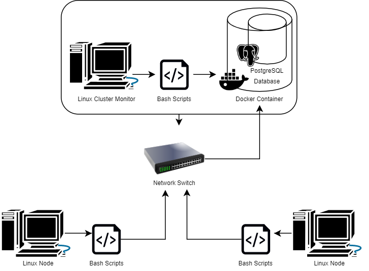

# Linux Cluster Monitoring Agent
# Introduction
The Linux Cluster Monitoring Agent (LCMA) is a cluster monitoring system that records the hardware and resource usage of each host in a system. This script is used by the Jarvis Linux Cluster Administration (LCA) team to manage a Linux cluster running on CentOS 7. Variables collected include the host's CPU number, total memory, memory free, disk I/O, CPU MHz and more, which are recorded to a PostgresSQL Docker RDBMS database every minute using a bash script running through crontab. The LCMA uses the following technologies:
* PostgresSQL
* SQL
* Google Cloud Platform
* Docker
* Bash
* Git
* CentOS 7

# Quick Start
1. Start the PSQL Docker instance using the `psql_docker.sh` script.
  ```bash
  #if PSQL Docker container does not exist, create a PSQL Docker container
  ./scripts/psql_docker.sh create psql_user psql_password
  
  #once PSQL Docker container is created, start the container
  ./scripts/psql_docker.sh start
```
2. Create and initialize `host_info` and `host_usage` SQL tables using `ddl.sql` script.
```bash
psql -h psql_host -U psql_user -d db_name -f sql/ddl.sql
```
3. Insert node hardware data into the database, `host_agent`, using `host_info.sh` script.
```bash
./scripts/host_info.sh psql_host psql_port db_name psql_user psql_password
```
4. Insert node hardware usage data into the database, `host_agent`, using `host_usage.sh` script.
```bash
./scripts/host_usage.sh psql_host psql_port db_name psql_user psql_password
```
5. Set up crontab to allow `host_usage.sh` to run every minute. Start by entering the crontab editor:
```bash
crontab -e
```
6. Add the following code into the crontab file:
```
* * * * * ./<PATH>/host_usage.sh psql_host psql_port db_name psql_user psql_password > /tmp/host_usage.log
```
7. View hardware resource usage data by using `queries.sql`.
```bash
psql -h psql_host -U psql_user -d db_name -f sql/queries.sql
```

# Implementation
`psql_docker.sh`
* Creates a PSQL database provisioned by a Docker container.

`ddl.sql`
* Uses SQL statements to create `host_info` and `host_usage` tables.

`host_info.sh` and `host_usage.sh`
* Uses bash script to find hardware specs and resource usage data.

`queries.sql`
* Uses SQL queries to answer simple business questions.

## Architecture


## Scripts
The monitoring agent scripts require command line arguments in order to collect data in the PSQL Docker instance. The arguments should contain the following values:
* `psql_host`: localhost
* `psql_port`: 5432
* `db_name`: host_agent
* `psql_user`: postgres
* `psql_password`: password

`psql_docker.sh`:
* A bash script that can create, start or stop a container.
  * To create a container: `./scripts/psql_docker.sh create psql_user psql_password`
  * To start the container: `./scripts/psql_docker.sh start`
  * To stop the container: `./scripts/psql_docker.sh stop`
    
`host_info.sh`:
* A bash script that will collect the hardware information of a node and insert it into the database.
  * To run: `./scripts/host_info.sh psql_host psql_port db_name psql_user psql_password`

`host_usage.sh`:
* A bash script that will collect resource usage data of a node and insert it into the database. This script runs every minute using Crontab.
  * To run: `./scripts/host_usage.sh psql_host psql_port db_name psql_user psql_password` 

`crontab`
* Crontab script is used to automate `host_usage.sh` every minute.
  * To edit file: `crontab -e`
  * Add to file: `* * * * * ./<PATH>/host_usage.sh psql_host psql_port db_name psql_user psql_password > /tmp/host_usage.log`

`ddl.sql`:
* An SQL script that switches the user to the `host_agent` database and defines `host_info` and `host_usage` tables.
  * To run: `psql -h psql_host -U psql_user -d db_name -f sql/ddl.sql` 

`queries.sql`:
* An SQL script that queries data from the `host_info` and `host_usage` tables to verify that the program is working. 
  * Test cases include:
    * Grouping hosts by CPU number and sorting them by their total memory in descending order.
    * Finding the average memory used in percentage over a five-minute interval.
    * Detecting server failure by checking if less than three data points are inserted within a five-minute interval.
  * To run: `psql -h psql_host -U psql_user -d db_name -f sql/queries.sql`

## Database Modelling
###`host_info`:

Attribute  | Data Type | Constraint | Description
----------|-----------|---------|------------
`id`|`SERIAL`| `PRIMARY KEY` | Auto-incremented unique identifier of the node.
`hostname` | `VARCHAR` | `UNIQUE` | Name of the host computer.
`cpu_number`|`INT`| `NOT NULL` |Number of CPUs on the host computer.
`cpu_architecture`|`VARCHAR`|`NOT NULL` | Type of CPU architecture.
`cpu_model`|`VARCHAR`|`NOT NULL` | Type of CPU processor model.
`cpu_mhz`|`FLOAT`|`NOT NULL` |Speed of CPU processor (in MHz).
`L2_cache`|`INT`|`NOT NULL` |Size of the L2 cache (in kB).
`total_mem`|`INT`|`NOT NULL` |Total memory on the host computer (in kB).
`timestamp`|`TIMESTAMP`|`NOT NULL` |The time of data entry (in YYYY-MM-DD HH:MM:SS format).

###`host_usage`:

Attribute  | Data Type | Constraint | Description
----------|-----------|--------|-----------
`timestamp`|`TIMESTAMP`|`PRIMARY KEY`|The time of data entry (in YYYY-MM-DD HH:MM:SS format).<br/>Unique identifier of the node.
`host_id`|`INT`|`REFERENCES host_info(id)` |Foreign key referencing `id` attribute from `host_info`.
`memory_free`|`INT`|`NOT NULL` |Total unused memory on the host computer (in kB).
`cpu_idle`|`INT`|`NOT NULL` |CPU processor idle time (%).
`cpu_kernel`|`INT`|`NOT NULL` |CPU kernel run time (%).
`disk_io`|`INT`|`NOT NULL` |Number of disk I/O.
`disk_available`|`INT`|`NOT NULL` |Total available disk space (in mB).

# Test
The LCMA was set up and tested on the CentOS 7 terminal. Testing was performed by executing invalid and valid command line arguments on bash scripts: `host_info.sh`, `host_usage.sh` and `psql_docker.sh`. For `ddl.sql` and `queries.sql`, these files were tested using an SQL client software application called DBeaver. SQL statements were executed and tested on DBeaver individually to ensure that the result data and queries are correct.

# Deployment
* JRD (Jarvis Remote Desktop) VM instance is provisioned by Google Cloud Platform to run CentOS 7.
* PostgresSQL container was run using Docker.
* Git version control system is used to execute the GitFlow model for implementation.

# Improvements
* A user interface to easily access, sort, insert and delete data from the `host_agent` database.
* An automated program to transfer outdated `host_usage` data to a backup database after a specified amount of time.
* An automated report that keeps track of the amount of entries and the amount of space remaining in `host_agent`.
* An efficient error handling program that checks for database, host, or container failure.